## Task Part 1 - Introduction to Data Warehouse

### 1. Perbedaan antara data warehouse dan data lake:

Struktur data:
- Data warehouse: data dalam data warehouse adalah data yang sudah diproses atau sudah di transformasi
- Data lake: data dalam data lake adalah berupa data mentah (raw data)

Tujuan utama:
- Data warehouse: Tujuan utamanya adalah untuk menyajikan data yang telah diolah dan dioptimalkan secara efisien agar dapat digunakan untuk pelaporan, analisis bisnis, dan pengambilan keputusan. Bisa dibilang, data pada data warehouse sudah terdefinisikan dengan baik penggunaannya untuk apa.
- Data lake: data lake memiliki tujuan yang lebih luas dan fleksibel. Tujuan utamanya adalah untuk menyimpan berbagai jenis data, seperti raw data, semi-structured data, dan unstructured data, tanpa perlu pemodelan data sebelumnya. Karena maksud penggunaan data belum terdefinisikan, ini memungkinkan eksplorasi data yang lebih mendalam dan kebebasan dalam penggunaan data.

Skala dan Fleksibilitas:
- Data Warehouse: Data warehouse umumnya lebih terbatas dalam skala dan jenis data yang dapat diakomodasi. Dalam hal ini adalah structured data, yaitu data yang telah diatur dalam format tabel dengan skema yang sudah didefinisikan sebelumnya.
- Data Lake: Data lake lebih skalabel dan fleksibel. Ini dapat menampung berbagai jenis data, termasuk teks, gambar, audio, dan data lainnya tanpa perlu perubahan skema.

Biaya:
- Data Warehouse: Data warehouse cenderung lebih mahal karena memerlukan perencanaan dan pemodelan data yang lebih cermat. Biaya infrastruktur dan perangkat lunaknya juga bisa tinggi.
- Data Lake: Data lake dapat lebih ekonomis karena dapat menggunakan penyimpanan skala besar yang lebih murah, seperti penyimpanan cloud.

### 2. Perbedaan database untuk data warehouse (OLAP) dan database konvensional (OLTP):

Fokus utama:
- OLAP: Fokus utama adalah untuk analisis dan pelaporan. Biasanya digunakan untuk menghasilkan laporan bisnis, analisis tren, dan pemodelan data.
- OLTP: Fokus utama adalah pada pencatatan, pembaruan, dan pengambilan data dalam transaksi bisnis, seperti penjualan, pemesanan, dan manajemen stok. Biasanya digunakan untuk mendukung transaksi bisnis sehari-hari.

Struktur data:
- OLAP: Data sering kali berbentuk denormalisasi, yang memungkinkan query yang efisien dan cepat.
- OLTP: biasanya berisi data yang terstruktur dengan baik dan normalisasi untuk menghindari duplikasi data.

Volume data:
- OLAP: seringkali menyimpan volume data yang besar, termasuk sejarah data bisnis, data agregat, dan data berdasarkan waktu. Data ini digunakan untuk analisis jangka panjang dan pemantauan kinerja bisnis.
- OLTP: biasanya menyimpan data transaksi saat ini atau data operasional yang berkaitan dengan transaksi terkini. Volume data biasanya lebih kecil, tetapi lebih sering diakses dan diperbarui.

Perubahan data:
- OLAP: umumnya tidak mengalami banyak perubahan data dalam jangka waktu singkat. Data umumnya dimuat secara periodik dari sumber data.
- OLTP: mengalami perubahan data yang sering, seperti pembaruan, penambahan, atau penghapusan transaksi.

### 3. Teknologi yang biasanya dipakai untuk data warehouse:
- AWS Redshift
- Google Big Query
- Clickhouse
- Snowflake
- Databricks
- Apache Dorris
- Postgre (with Citus extension)

### 4. Langkah-langkah instalasi citus dengan docker compose sampai tabel terbentuk:
#### 1) Buka repo docker https://github.com/citusdata/docker

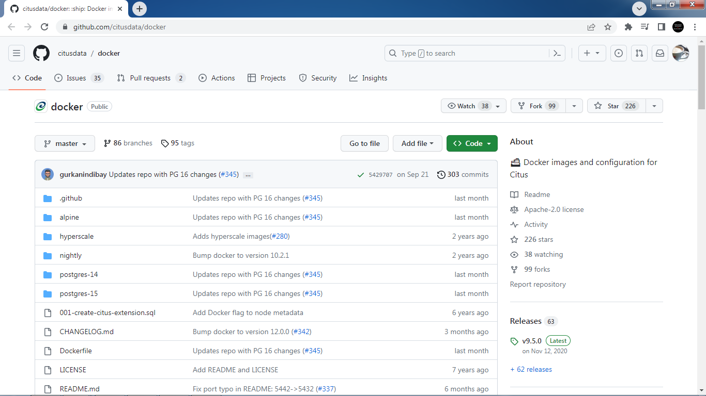

#### 2) Buka file docker-compose.yml

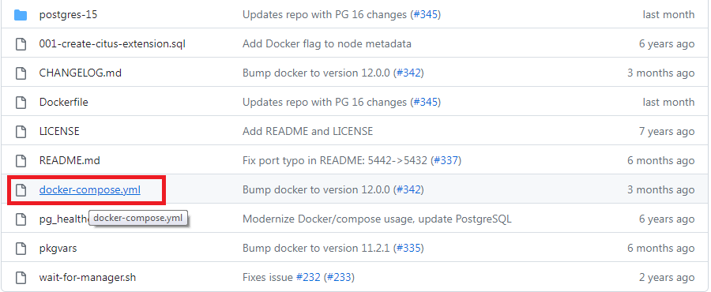

#### 3) Copy raw file

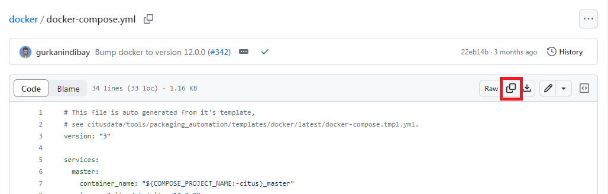

#### 4) Buat direktori baru 'try-citus' lalu pindah ke direktori tersebut
```
mkdir try-citus
cd try-citus
```
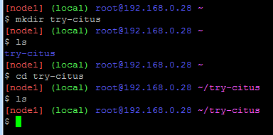

#### 5) Buka teks editor dan buat file docker-compose.yml
```
vi docker-compose.yml
```
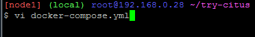
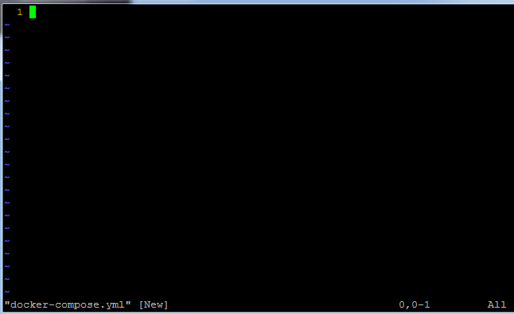

#### 6) Paste raw file yang sudah di copy pada langkah 3 ke file baru 'docker-compose.yml' yang dibuat tadi lalu ubah beberapa value:

master:
- container_name: "citus_master"
- ports: ["5500:5432"]

master environment:
- POSTGRES_USER: "mysuperuser"
- POSTGRES_PASSWORD: "superpass123"
- PGUSER: "myuser"
- PGPASSWORD: "pass123"
- POSTGRES_HOST_AUTH_METHOD: "trust"

manager:
- container_name: "citus_manager"

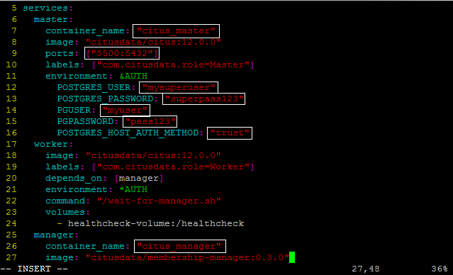

#### 7) Setelah melakukan perubahan, save file lalu jalankan perintah docker-compose dalam mode background dengan nama project 'citus'
```
docker-compose -p citus up -d
```
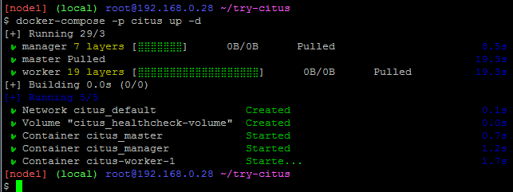

#### 8) Cek apakah container yang dibuat sudah berjalan
```
docker ps
```
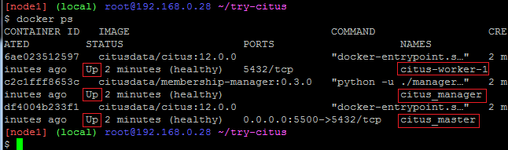

#### 9) Buka terminal interaktif dalam container citus_master
```
docker exec -it citus_master bash
```
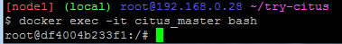

#### 10) Connect ke postgreSQL dengan user 'mysuperuser' dan database 'postgres'
```
psql -U mysuperuser -d postgres
```
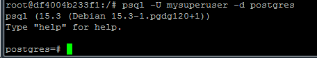

#### 11) Buat ekstensi citus
```
create extension citus;
```


#### 12) Buat table 'events_columnar' menggunakan metode penyimpanan columnar
```
create table events_columnar (
	device_id bigint,
	event_id bigserial,
	event_time timestamptz default now(),
	data jsonb not null
)
using columnar;
```
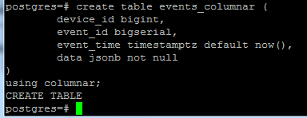

#### 13) Masukkan data ke dalam tabel
```
insert into events_columnar (device_id, data)
select d, '{"hello":"columnar"}' from generate_series(1,100) d;
```
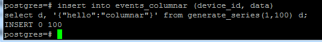

#### 14) Buat tabel 'events_row' dari tabel yang sudah ada untuk perbandingan
```
create table events_row as select * from events_columnar;
```
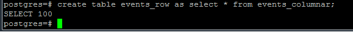

#### 15) Tampilkan 10 baris data dari masing-masing tabel
```
select * from events_columnar limit 10;
```
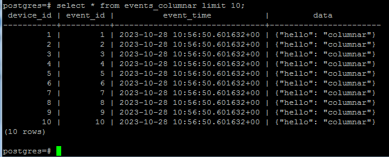
```
select * from events_row limit 10;
```
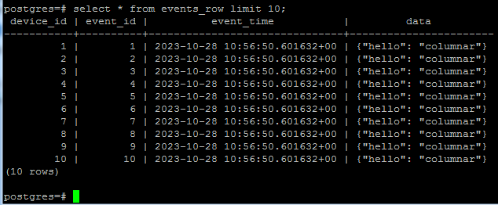

#### 16) Tampilkan informasi rinci tabel
```
\dt+
```
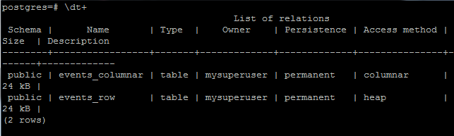

### 5. Perbedaan access method heap dan columnar:
Heap

Data dalam access method heap disimpan dalam format row-based, yang berarti bahwa setiap baris data lengkap dengan semua kolomnya disimpan dalam blok penyimpanan. Penyimpanan data dalam format heap (row-based) biasanya lebih besar dalam ukuran dibandingkan dengan penyimpanan data columnar. Ini karena setiap baris data mengandung seluruh baris data, termasuk semua kolom, yang menyebabkan pengulangan data di beberapa kolom.

Columnar

Data dalam access method columnar disimpan dalam format column-based, yang berarti bahwa data dari setiap kolom (misalnya, semua nilai dalam kolom tertentu) disimpan bersama dalam blok penyimpanan. Penyimpanan data dalam format columnar cenderung lebih efisien dalam hal ukuran penyimpanan. Ini karena data dalam setiap kolom disimpan bersama-sama dalam blok penyimpanan, dan duplikasi data yang sama dalam kolom sering disusun dan disatukan secara efisien.
