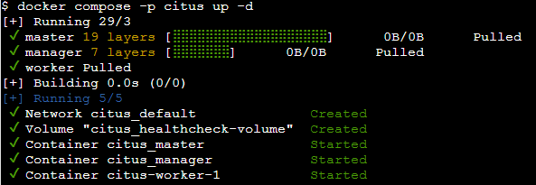
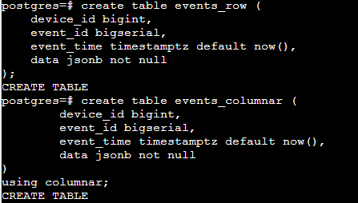
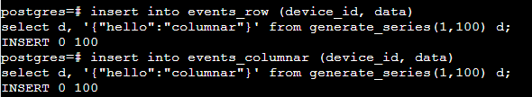
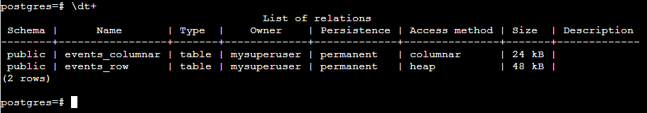

## Task Part 2 - Columnar Database

### 1. Jalankan Citus dengan [docker compose](docker-compose.yml)!
```
docker-compose -p citus up -d
```


### 2. Tuliskan perintah untuk membuat:
#### a. tabel biasa (row-based)
```
create table events_row (
	device_id bigint,
	event_id bigserial,
	event_time timestamptz default now(),
	data jsonb not null
);
```

#### b. Columnar tabel (column-based)
```
create table events_columnar (
	device_id bigint,
	event_id bigserial,
	event_time timestamptz default now(),
	data jsonb not null
)
using columnar;
```


### 3. Masukkan 100 baris data ke dalam tabel biasa dan tabel columnar!
```
insert into events_row (device_id, data)
select d, '{"hello":"columnar"}' from generate_series(1,100) d;
```
```
insert into events_columnar (device_id, data)
select d, '{"hello":"columnar"}' from generate_series(1,100) d;
```


### 4. Tampilkan perbedaan ukuran kedua tabel!
```
\dt+
```


### 5. Kesimpulan
Tabel columnar cenderung memiliki ukuran penyimpanan yang lebih efisien dibandingkan dengan tabel row, karena kemampuan kompresi data yang baik dalam format columnar. Sehingga format penyimpanan columnar sangat cocok ketika kita memiliki volume data yang besar karena format penyimpanan columnar dapat mengurangi ukuran penyimpanan secara signifikan.
