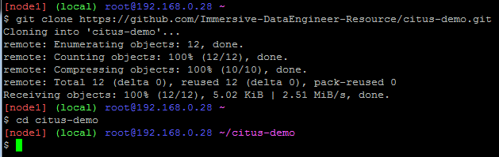
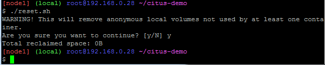
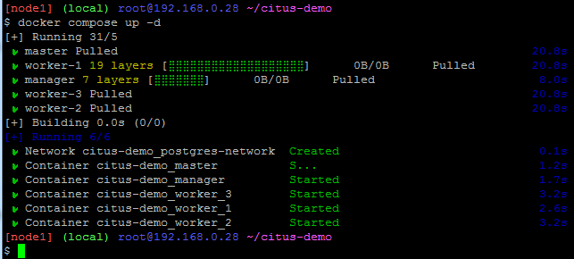
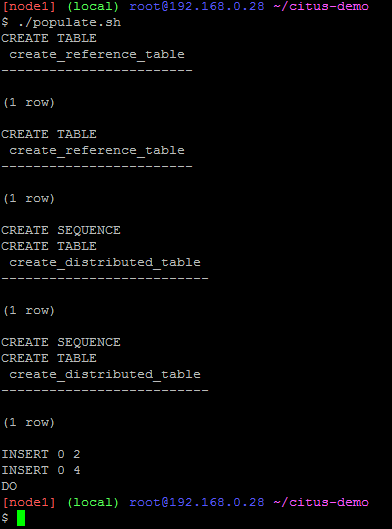
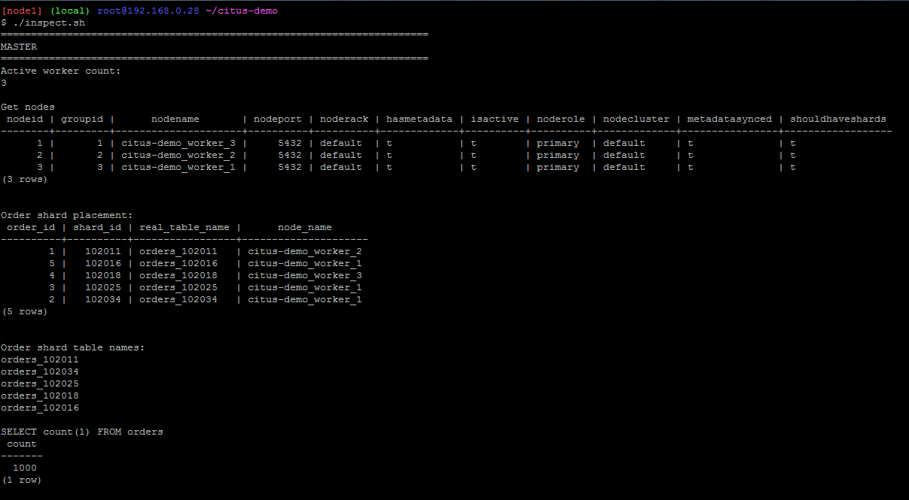
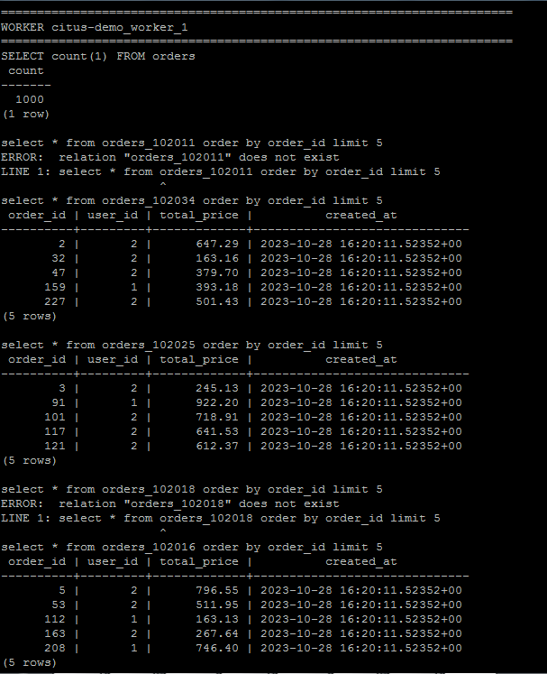
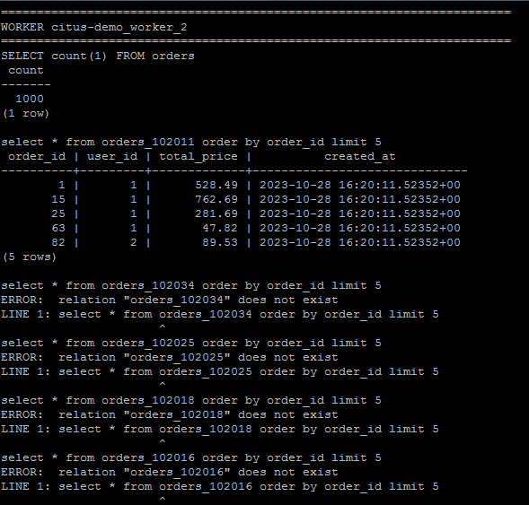
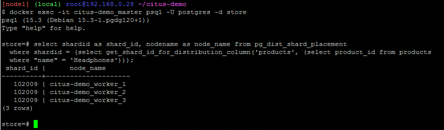
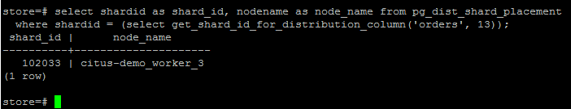

## Task Part 3 - Replication + Sharding

### 1. Jelaskan perbedaan antara replication dan sharding!
#### Replication

Replication adalah metode yang digunakan untuk menciptakan salinan data yang identik di beberapa node
- Tujuan: meningkatkan ketersediaan data, mengurangi waktu pemulihan jika satu node gagal, dan memungkinkan akses lokal ke data.
- Penggunaan: digunakan untuk backup/high availability (menjaga sistem agar tetap aktif dan berfungsi, bahkan saat terjadi gangguan).
- Data Distribution: semua node memiliki salinan data yang sama.
- Ketergantungan antar node: tidak ada ketergantungan erat antar node, dan setiap node dapat merespons permintaan tanpa harus berkomunikasi dengan node lain.
- Skalabilitas: replication tidak secara langsung mengatasi masalah skala horizontal. Ini lebih cocok untuk meningkatkan toleransi terhadap kegagalan dan ketersediaan daripada menangani data dalam skala besar.

#### Sharding

Sharding adalah metode yang digunakan untuk membagi data ke dalam beberapa bagian atau shard dan mendistribusikannya di antara sejumlah node
- Tujuan: meningkatkan skala dan kinerja sistem dengan mendistribusikan beban kerja ke beberapa node.
- Penggunaan: digunakan untuk data yang sangat besar dan saat performa dan skala menjadi prioritas. Ini umumnya digunakan dalam sistem analitis dan penyimpanan data besar.
- Data distribution: data dibagi menjadi bagian-bagian yang berbeda, dan setiap node hanya bertanggung jawab atas sebagian data (shard tertentu).
- Ketergantungan antar node: terkadang, ketergantungan antar node diperlukan untuk menggabungkan data dari beberapa shard.
- Skalabilitas: sharding adalah solusi yang memungkinkan skalabilitas horizontal, yang memungkinkan penanganan data dalam skala besar.

### 2. Lakukan percobaan pada repo [citus-demo](https://github.com/Immersive-DataEngineer-Resource/citus-demo)!

#### 1) clone repo lalu pindah ke direktori 'citus-demo'
```
git clone https://github.com/Immersive-DataEngineer-Resource/citus-demo.git
cd citus-demo
```


#### 2) jalankan file reset.sh
```
./reset.sh
```


#### 3) jalankan docker compose lalu tunggu sampai semua worker siap
```
docker compose up -d
```


#### 4) jalankan file populate.sh
```
./populate.sh
```


#### 5) jalankan file inspect.sh
```
./inspect.sh
```





### 3. Di node/worker mana saja product "Headphone" tersimpan? Tunjukkan shard id nya!
```
select shardid as shard_id, nodename as node_name from pg_dist_shard_placement
  where shardid = (select get_shard_id_for_distribution_column('products', (select product_id from products
  where "name" = 'Headphones')));
```

- product headphone dengan shard id 102009 ada di node/worker 1, 2, dan 3 karena table products tidak di distribute melainkan di replicate. Sehingga tiap node memiliki data products yang sama.
- untuk mengetahui di shard mana suatu data tertentu akan disimpan, bisa menggunakan fungsi ```get_shard_id_for_distribution_column``` dengan parameter ```(<nama_tabel>, <id/kolom_distribusi>)```
- untuk menemukan di node mana suatu shardid disimpan, bisa menggunakan query:
```
select * from pg_dist_shard_placement
where shardid = <shard_id>
```
- untuk mengetahui id headphones, menggunakan query:
```
select product_id from products
where "name" = 'Headphones'
```

### 4. Di node/worker mana saja order dengan id 13 tersimpan? Tunjukkan shard id nya!
```
select shardid as shard_id, nodename as node_name from pg_dist_shard_placement
  where shardid = (select get_shard_id_for_distribution_column('orders', 13));
```

- order dengan id 13 hanya ada di node/worker 3 dengan shard id 102033 karena tabel orders di distribute berdasarkan order_id yang sudah dibuat sequence sebelumnya sehingga setiap order_id pasti hanya terdapat di salah satu node/worker.

### 5. Kapan sebaiknya kita menggunakan replication?
- Ketika membutuhkan high availability. Dengan melakukan replication data, dapat mengurangi risiko downtime akibat system error di suatu node/server. Karena node/server yang lain dapat mem backup nya.

### 6. Kapan sebaiknya kita menggunakan sharding?
- Ketika memiliki volume data yang besar dan tidak dapat ditangani hanya dengan satu node/server. Dengan melakukan sharding, data didistribusikan ke beberapa node/server sehingga masing-masing node/server tersebut akan mengelola dataset yang lebih kecil.
- Ketika membutuhkan kinerja yang lebih baik. Dengan melakukan sharding, berarti beban node/server utama dapat terbagi ke beberapa node/server, sehingga menghasilkan pemrosesan yang lebih cepat.
