## Task Part 4 - Google Cloud Storage

### 1. Buat sebuah bucket di GCS, upload beberapa file ke bucket tersebut!
#### 1) Cari 'bucket' di kotak pencarian lalu pilih 'Buckets'
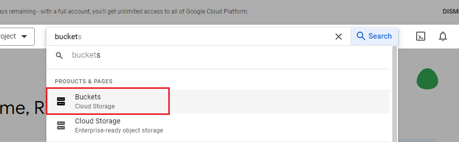

#### 2) Pilih create
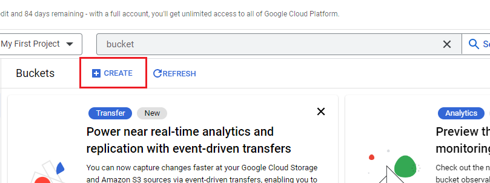

#### 3) Beri nama, lalu continue
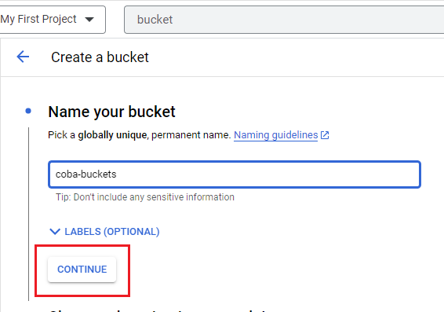

#### 4) Lengkapi semua data yang lain, lalu create
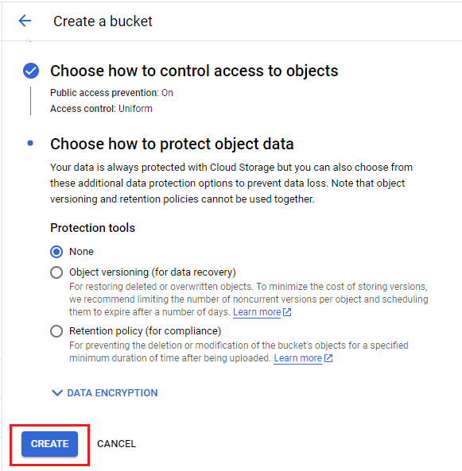

#### 5) Bucket berhasil dibuat
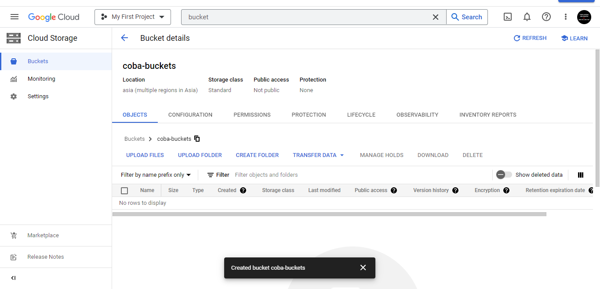

#### 6) Pilih upload files
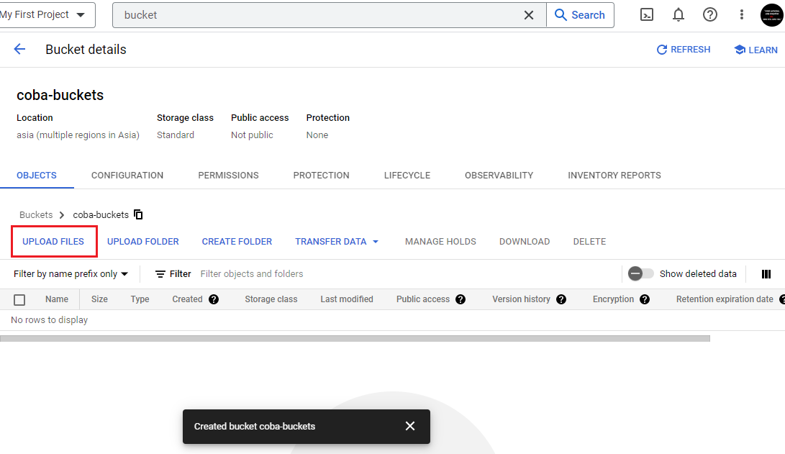

#### 7) Files berhasil diupload
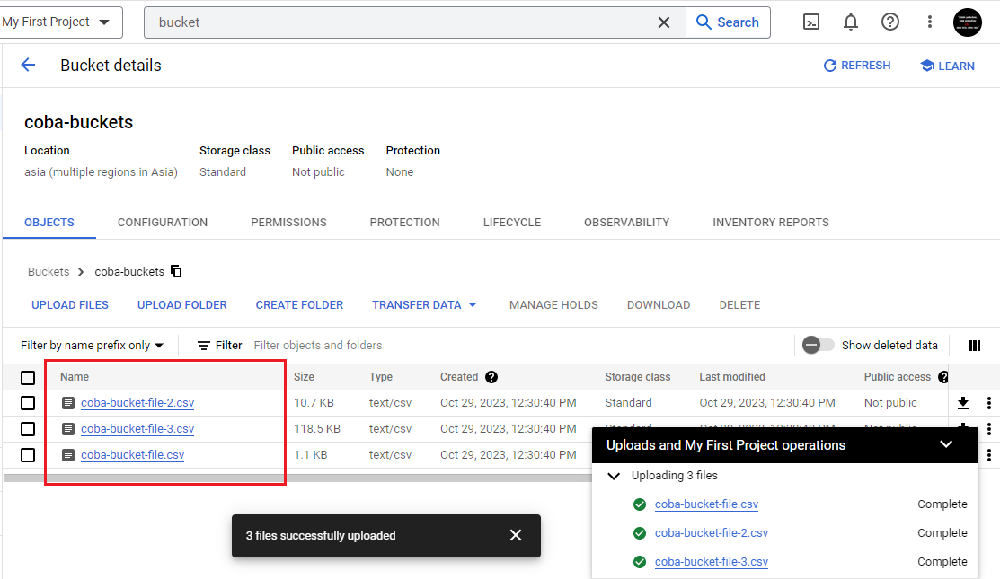

### 2. Hapus file yang sudah diupload!
#### 1) Select all rows untuk memilih semua file lalu pilih delete
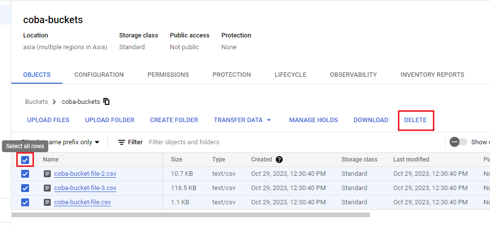

#### 2) Confirm delete
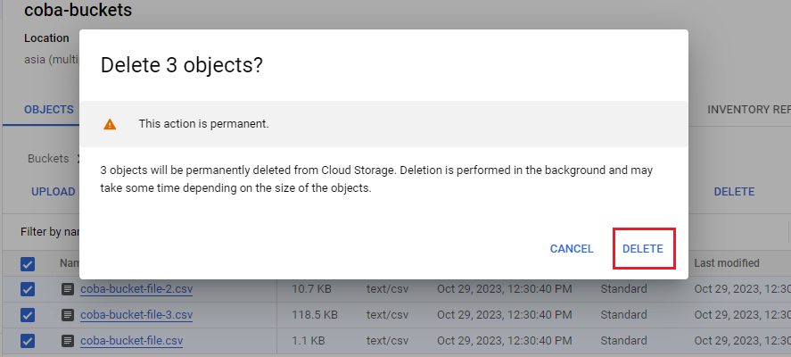

#### 3) File berhasil dihapus


### 3. Lakukan eksplorasi sample data [wikipedia](https://console.cloud.google.com/bigquery?p=bigquery-public-data&d=samples&t=wikipedia&page=table) dengan menggunakan big query!
#### 1) Masuk ke [link](https://console.cloud.google.com/bigquery?p=bigquery-public-data&d=samples&t=wikipedia&page=table) lalu buka query
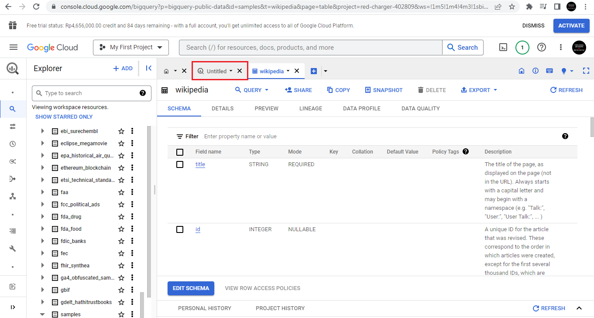

#### 2) Jalankan beberapa query
```
select count(1) from `bigquery-public-data.samples.wikipedia`;
```
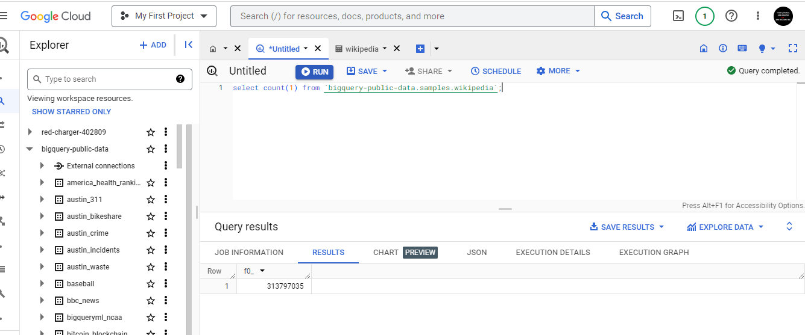

```
select * from `bigquery-public-data.samples.wikipedia` limit 10;
```
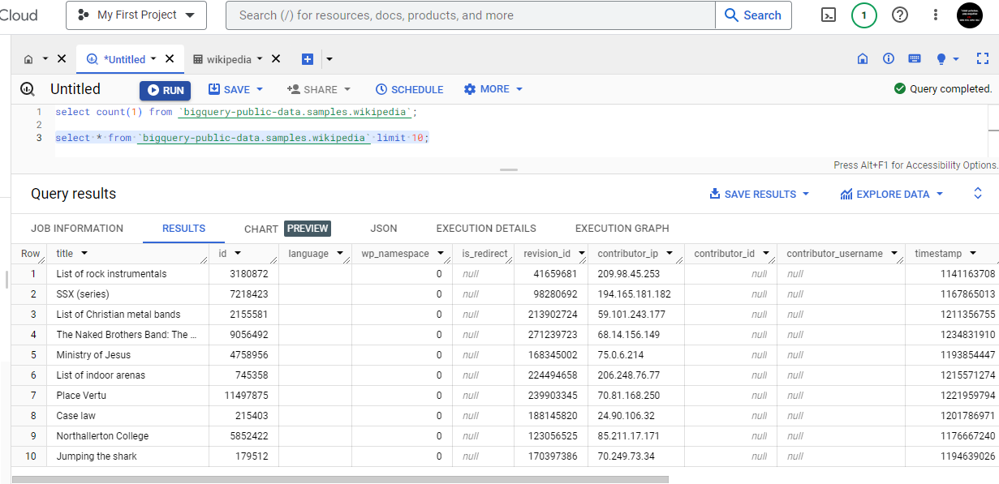

```
select title, num_characters from `bigquery-public-data.samples.wikipedia`
where id > 999999
order by num_characters desc
limit 5;
```
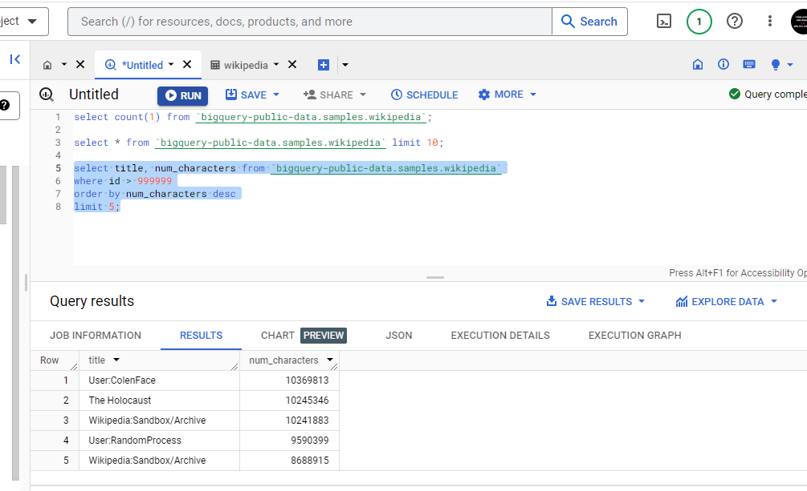

```
select title, num_characters from `bigquery-public-data.samples.wikipedia`
where title like '%indonesia%'
and num_characters between 10 and 100
and length(title) < 20
order by num_characters desc
limit 5;
```
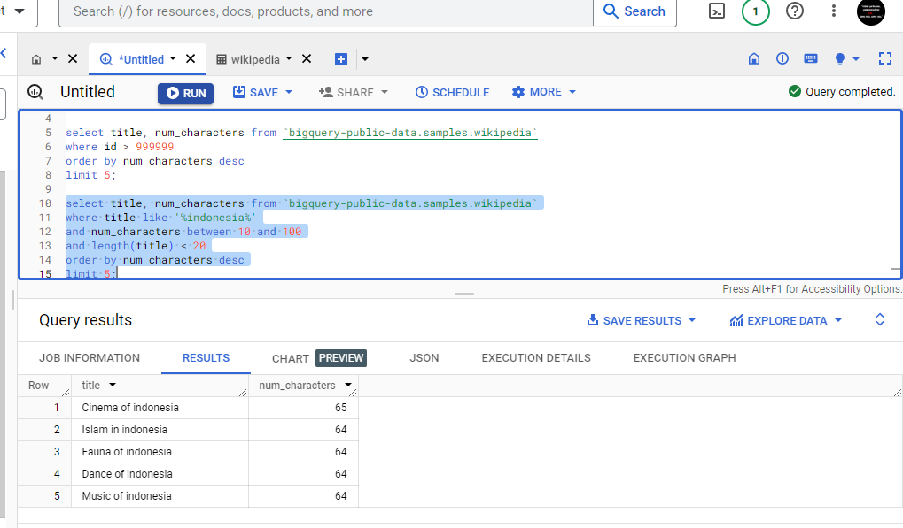

### 4. Munculkan jumlah kontribusi dari masing-masing contributor_ip, urutkan dari kontribusi terbesar ke kontribusi terkecil!
```
select contributor_ip, count(*) as jumlah_kontribusi
from `bigquery-public-data.samples.wikipedia`
group by contributor_ip
order by jumlah_kontribusi desc;
```
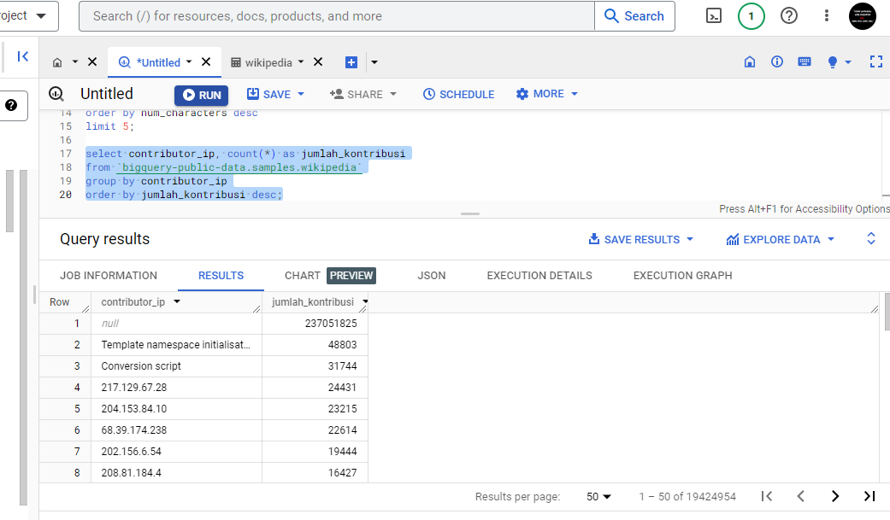
